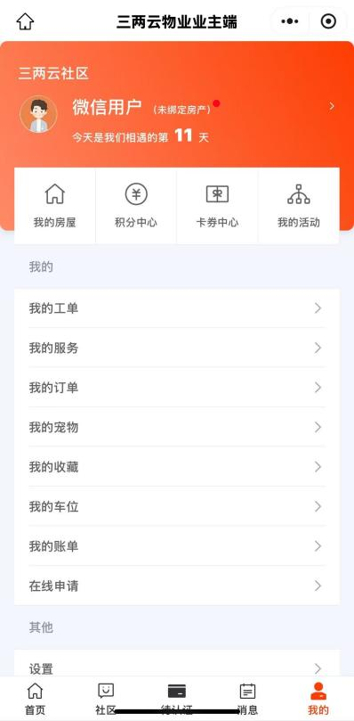
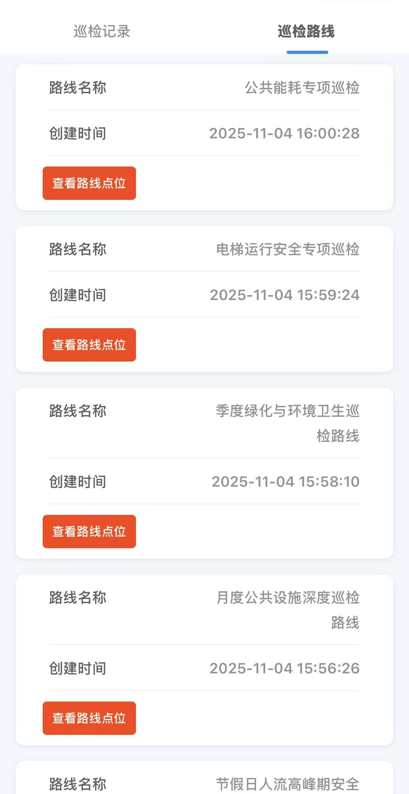
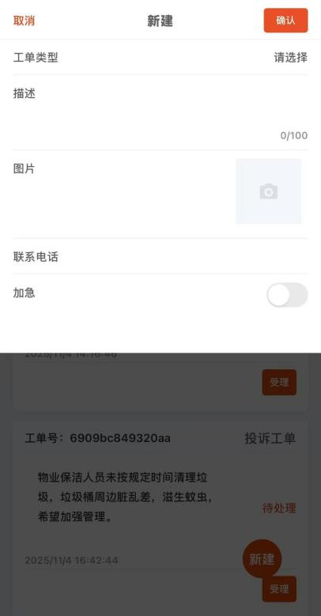
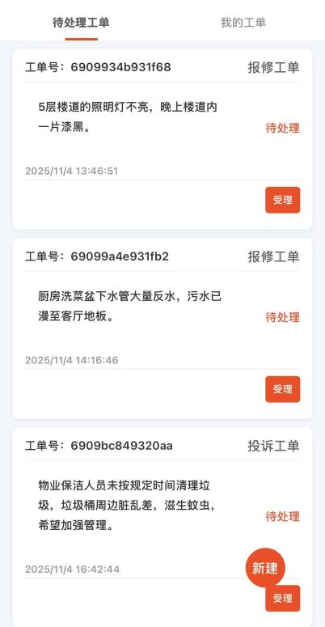

# 产品介绍

三两云物业系统无线端是为小区打造的一站式智慧生活服务平台，深度整合物业服务、社区互动、个人事务管理等场景。通过无线端即可便捷享受报修、缴费、查询公告、参与社区活动、互动交流、园区安全保障等服务，打破传统物业沟通壁垒，实现服务需求 “一键触达”、社区动态 “实时掌握”、个人事务 “线上闭环”，让业主从 “被动接收服务” 转向 “主动参与社区生活”，让保安人员在巡逻、门岗、应急处理等场景下高效作业，全面提升居住体验与社区归属感。

# 体验地址
业主端：

保安端：

1. 用微信扫码系统二维码
2. 第一次体验，需要关注服务号
3. 自动进入系统

# 功能亮点
- 全场景移动化覆盖：整合巡检、访客、工单等场景，保安人员通过手机即可完成巡逻记录、门岗登记、工单受理等全流程工作，大大方便了现场工作的开展。
- 流程闭环高效管控：从接到一个任务，到登记访客信息、处理工单，再到最后反馈结果，整个流程都在线上有记录。这样既保证了每项工作都能追溯到人、明确责任，也避免了过程中信息丢失或者环节脱节的问题。
- 数据联动精准管理：手机端录入的信息（比如访客详情、维修需求），会实时同步到物业后台系统，业主在自己的手机端也能立即看到状态更新。这就形成了一个“保安操作-物业同步-业主感知”的数据闭环，让三方信息保持一致，协作起来更顺畅。
- 服务需求一键响应：聚合 “联系物业、维修上报、缴费清单、访客预约” 等核心服务入口，业主足不出户即可提交需求、查询进度，需求提交后处理进度一目了然，服务响应效率大幅提升。
- 社区互动生态活跃：设有活动、动态、集市版块，方便业主们发起活动、交流话题。通过这些功能，促进邻里之间的互动，帮助整个社区氛围变得更融洽、更有温度。
- 信息触达精准及时：小区公告、活动通知、服务提醒等信息通过平台实时推送，确保业主第一时间知晓停水、设备维护等关键事项，避免错过任何关键消息。

# 核心功能
## - 业主端
### 1.首页服务
- 基础服务入口：提供 “联系物业”（在线沟通报修、投诉）、“维修上报”（图文描述故障并跟踪处理进度）、“违章抓拍”（业主上传小区违章行为线索）、“活动中心”（查看 / 报名社区活动）等功能，满足日常服务需求。
- 生活事务管理：支持 “缴费清单”（查询水电、物业费等账单并在线支付）、“访客预约”（提前登记访客信息，实现智能门禁放行）、“在线申请”（如装修申请、车位申请等），让生活事务办理更高效。

### 2.社区互动
- 活动与动态：在 “社区” 板块可浏览 “活动列表”并参与报名，同时支持业主发布 “社区动态”（分享生活、发起话题），还可进入 “集市” 板块进行邻里间的闲置物品交易，激活社区社交与资源共享。
- 互动功能：支持对动态内容点赞、评论，增强业主间的互动粘性，营造活跃的社区氛围。

### 3.个人中心
- 资产与事务管理：可管理 “我的房屋”（查看房屋信息、绑定房产）、“我的车位”（车位状态查询、缴费）、“我的宠物”（宠物信息登记、管理）；跟踪 “我的工单”（报修进度、处理结果）、“我的订单”（服务类订单、商品订单）、“我的账单”（各类费用账单明细）。
- 权益与互动：设有 “积分中心”（查询积分获取、兑换记录）、“卡券中心”（领取 / 使用物业发放的优惠卡券）、“我的活动”（已报名活动的查看与管理），同时可查看 “消息通知”（服务提醒、社区公告等），实现个人权益与事务的集中管控。

## - 保安端
### 首页展示

### 1.日常巡检
- 巡检路线管理：支持查看各类定制化巡检路线，如 “公共能耗专项巡检”“电梯运行安全专项巡检”等，点击 “查看路线点位” 可查看具体巡检点位与检查标准，确保保安按规完成巡逻任务，覆盖园区设施、环境、安全等多维度检查。

### 2.物业扫码
- 通过 “物业扫码” 功能，对园区设备（如电梯、消防设施、公共水电设备）进行扫码打卡或状态记录，实现设施巡检的数字化留痕与状态管控。

### 3.访客管理
- 门岗访客登记：提供 “访客类型、姓名、联系电话、车牌号、来访理由” 等信息录入入口，保安可快速登记访客信息，系统自动留存记录，既保障园区人员进出安全，又为访客放行提供合规依据，避免陌生人员随意进入。

### 4.工单处理
- 待处理工单受理：实时展示业主报修、投诉等待处理工单，保安可点击 “受理” 跟进工单处理，也可通过 “新建” 功能，添加类型、描述等，发起园区巡查中发现的问题工单（如设施损坏、安全隐患等），实现业主需求与园区问题的快速响应，缩短服务响应时间，提升业主满意度。

### 5.设施与特殊管理
- 水表抄表管理：通过移动端完成 “水表抄表” 数据录入，自动同步至物业财务与运营端，替代传统人工抄表的低效与误差，确保水电费用核算精准。
- 宠物登记管理：录入园区宠物 “房产关联（如西区 5 单元 501）、宠物类型（小型犬等）、照片、备注” 等信息，便于保安掌握园区宠物分布与管理规范，避免宠物扰民或流浪宠物问题，助力构建文明园区环境。

### 6.消息中心
- 实时通知与预警：集中接收 “工单提醒、巡检任务、访客放行通知、系统公告” 等实时消息，确保保安第一时间响应关键事务，避免信息遗漏导致的服务延迟或安全风险。

# 开源协议

[AGPL-3.0 License](https://www.gnu.org/licenses/gpl-3.0.html)

- 执行标准 AGPL 协议，无任何其他限制条款，可以自用和商用，但必须保留原知识产权

# 本地开发说明

- 本项目非传统 Spring boot 的项目，不适合个人学习使用。
- 项目中大量代码由低码工具生成，lowcode 目录代码不要强行改写会影响迭代升级。
- 为了提升业务对象对大模型的友好性，我们研发上禁止了 SQL 编程，所以项目不包含任何 SQL 语言，不要误认为代码不全，工程可以完整运行
- 低码引擎会自动创建表，自动适配不同类型数据库，不需要数据库初始化脚本

# 为什么本地源码打包后，程序体积变大

- 本地打包是标准 mvn 打包模式。公司内部研发平台，增加了编译优化逻辑，将 jar 包体积减少 50%以上，程序启动速度，运行性能也有明显提升。

## 源码目录结构

- landlord 目录是 Java 源码文件
- vue 目录是前端源码文件
- release 打包后的二进制文件与启动脚本，私有部署的话只需要看这个目录就行

## IDE 里工程启动说明

- 启动 java 工程，初次启动时系统会载入安装配置页面
- 在浏览器里进入地址：http://127.0.0.1:7037/ ，配置数据库连接参数
- 进入 vue 目录，npm install -d 命令安装前端依赖
- 然后执行 npm run start 启动前端工程，即可进入开发模式，前端工程如何进入程序调试模式
- 💡💡💡 初次启动会报数据库链接异常，但应用已经启动，在浏览器中配置完数据库信息后，重新启动即可进入开发

## 工程打包部署

- 前端工程开发完成后，执行 npm run dist 命令构建前端脚本
- 将前端工程 dist 目录中构建好的 app.js 文件进行 gzip 压缩 (文件名保持不变)
- 压缩后的 app.js 文件复制到 java 工程 src/resources/static/ 目录里
- 进入 java 工程目录，执行 mvn clean && mvn package -f ./pom.xml 生成 java 二进制文件
- 最终部署文件地址：landlord/target/landlord.jar

# 关注微信服务号，了解更多

- 
